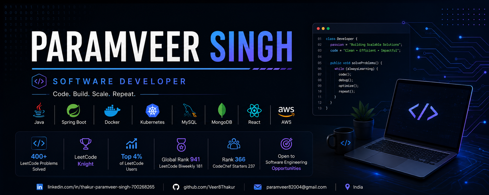

  

<h1 align="center">Hi 👋, I'm Paramveer Singh</h1>

<h3 align="center">Software Developer</h3>

Building Reliable Software • Solving Complex Problems

---

## 👨‍💻 About Me

🎓 Computer Science Graduate

💻 Software Developer

🚀 Passionate about Java, Spring Boot and Distributed Systems

🌱 Currently learning Kubernetes, Docker and AWS

🏆 LeetCode Knight

🧩 Solved 400+ DSA Problems

---

## 💻 Tech Stack

---

## 🚀 Featured Projects

| Project | Description |
|----------|-------------|
| 💬 Chat Engine | Real-time messaging using Spring Boot & WebSockets |
| 🤖 AI Fake News Classifier | NLP-based classification system |
| 📋 TaskCrafter | Enterprise task management platform |

---

## 📈 GitHub Stats

---

## 💻 Languages

---

## 📊 Contribution Graph

---

⭐ Thanks for visiting my profile!
